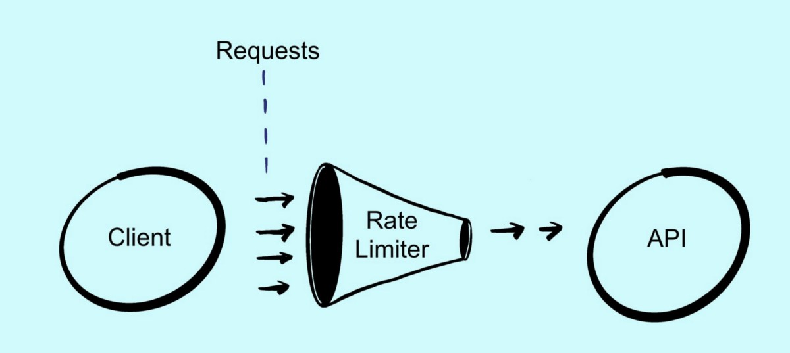
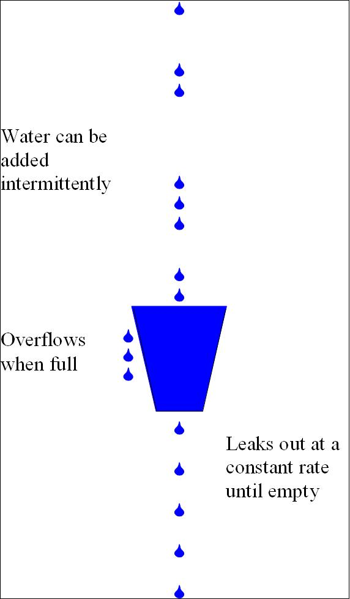

# Доказательство работы 
## Теория
### Rate Limiting
Rate Limiting - процесс контроля количества запросов, обрабатываемых 
какой-либо из частей системы.<br/><br/>

<br/><br/>
Rate Limiter'ы применяются в основном для предотвращения DoS атак и перегрузок
серверов, баз данных и сервисов, развернутых в облачных инфраструктурах.
<br />
Существует несколько алгоритмов, применяющихся для реализации концепции 
rate limiting. Мы реализовали алгоритм, называемый Leacky bucket.
#### Leacky bucket алгоритм
Алгоритм leacky bucket прост в реализации и понимании. Название "протекающее ведро" 
уже позволяет на интуитивном уровне понять суть его работы. <br/><br/>

<br/><br/>
Все приходящие запросы кладутся в очередь со своей (может быть непостоянной) скоростью.
Выход же из очереди происходит с постоянной, необходимой нам для корректной 
работы системы, скоростью до тех пор, пока очередь не пуста. Те же запросы
, которые приходят в момент полного заполнения очереди, не обрабатываются 
(ведро протекает).
## Реализация
При инициализации класса Bucket, представляющего собой нашу очередь, 
создается поток, который будет вычитывать запросы из очереди.
```java
Thread t = new BucketConsumer<>(rate, consumer, queue);
t.setDaemon(true);
t.start();
``` 
Из метода run класса BucketConsumer видно, что запросы будут вычитываться до тех 
пор пока очередь не пуста с той скоростью, которая нам необходима.
```java
T e = queue.poll();
while (e == null) {
    sleep((long) (1000 / rate));
    e = queue.poll();
    lastUpdateTime = System.nanoTime();
}
consumer.accept(e);
```
## Демонстрация
В методе main создаем наше ведро:
```java
Bucket<Integer> bucket = new Bucket<>(10, 2, x-> System.out.println(out(x)));
```
Видим, что мы указали, что максимальная длина нашей очереди 10, и мы хотим 
чтобы она пропускала 2 запроса в секунду. Чтобы это проверить,
запустим программу и проанализируем результат.
Структура вывода:
```java
element 48 is 1614. time passed: 24,013513
```
Это значит, что 48 взятый из очереди элемент является 1615ым из тех,
которые пытались в нее попасть, и прошло 24 секунды с момента запуска программы.<br/>
Возьмем первые 20 строк вывода:
```java
element 1 is 0. time passed: 0,506980
element 2 is 1. time passed: 1,029399
element 3 is 2. time passed: 1,516838
element 4 is 3. time passed: 2,017531
element 5 is 4. time passed: 2,512182
element 6 is 5. time passed: 3,016842
element 7 is 6. time passed: 3,517260
element 8 is 7. time passed: 4,014416
element 9 is 8. time passed: 4,512295
element 10 is 9. time passed: 5,012152
element 11 is 44. time passed: 5,512087
element 12 is 91. time passed: 6,013937
element 13 is 133. time passed: 6,513957
element 14 is 174. time passed: 7,013989
element 15 is 216. time passed: 7,516582
element 16 is 257. time passed: 8,015412
element 17 is 298. time passed: 8,514462
element 18 is 340. time passed: 9,016387
element 19 is 381. time passed: 9,514256
element 20 is 422. time passed: 10,015929
```
Из них мы видим, что:
- Первые 10 запросов, которые были обработаны, пришли последовательно.
Очередь была пуста и принимала их.
- Следующие обработанные запросы пришли не последовательно. Очередь была уже 
полна и новые запросы добавлялись в нее по мере освобождения места в очереди.
- 20 запросов обработалось за 10 секунд. Мы получили необходимую нам скорость
обработки запросов в 2 запроса в секунду.

Этих показателей достаточно, чтобы сделать вывод, что реализованный 
алгоритм leacky bucket работает.


 